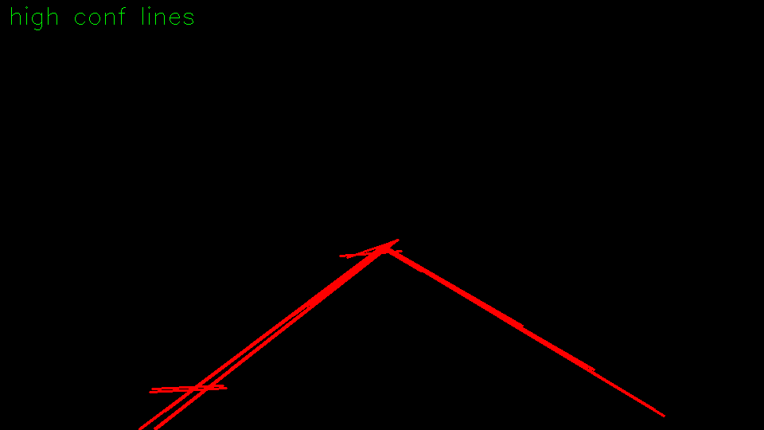
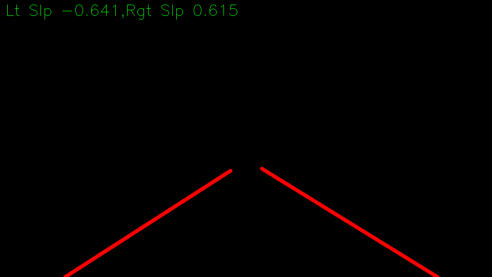
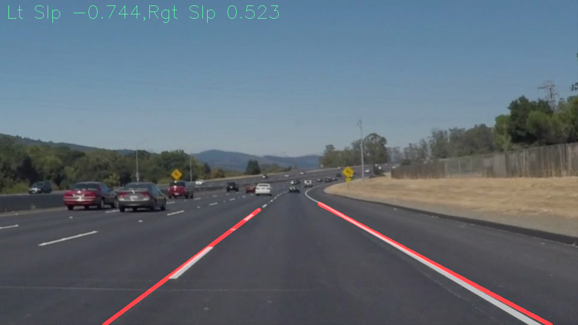
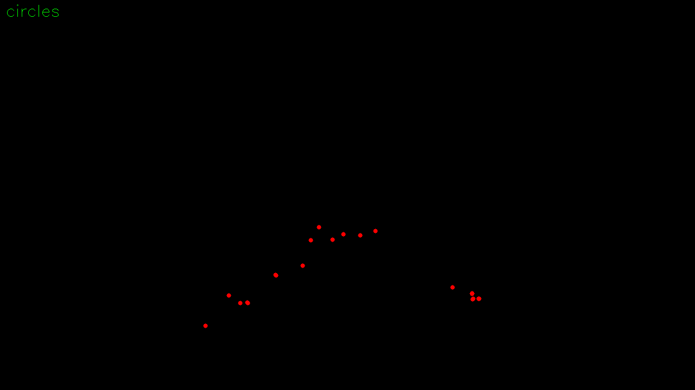

# **Finding Lane Lines on the Road** 

**Finding Lane Lines on the Road**

The goals / steps of this project are the following:
* Make a pipeline that finds lane lines on the road

[//]: # (Image References)

[image1]: ./examples/grayscale.jpg "Grayscale"

---

### Reflection

### 1. Describe your pipeline. As part of the description, explain how you modified the draw_lines() function.

First, highway image is loaded and converted to gray scale. Second, Canny edge detection algorithm takes gray scale image and apply noise reduction, find intensity gradient, NMS then threshold the gradients to get the edge image. 

Once, the edge image is generated from Canny detection, Hough Transformation is applied to transform pixels in cartesian space ($x,y$) to hough space ($m,b$). Since a line in cartesian space is a point in hough space, and a point in cartesian space is a line in hough space. In this case, when multiple lines intersect at a point in hough space, that means the line is a potential line in cartesian space. 

After threshold the potential lines according to vote, there will be several lines with high confidence. The next step is to separate right and left lines.

`draw_lines()` takes a bunch of lines, using slope to distinguish whether lines belong to right or left, if slope is negative that means the line belongs to left otherwise the line belongs to right.

After separation, left and right lines are averaged separately, then extrapolates to the bottom of image.

Caveat: since the coordinate is upside down compare to cartesian in image space, negative slope it's actually positive in cartesian space.

The final step, it's just put the line mask on the original image using `weighted_img()` 

In this project, I cached right/left line from each frame, then I applied moving average ($n=10$) to get a stable result.

**Without moving average**  

  

**With moving average**  

  

### 2. Identify potential shortcomings with your current pipeline
One potential shortcoming would be what would happen when the lane it's no longer a line,
Another shortcoming could be the light, when there is strong light, lane is merged in the background.

### 3. Suggest possible improvements to your pipeline

A possible improvement would be to find a middle point of a line, for example, a line consist of two points $(x1,y1),(x2,y2)$, instead of averaging the lines, first by computing the middle point of a line $((x2+x1)/2,(y2+y1)/2)$, repeat this for all the lines, we will get, 

We might get a better lane by fitting a polynomial line according to the graph above. 

Another potential improvement could be to find an appropriate color channel from color space, by doing so, the lighting noise could be canceled by using a more robust color filter.
